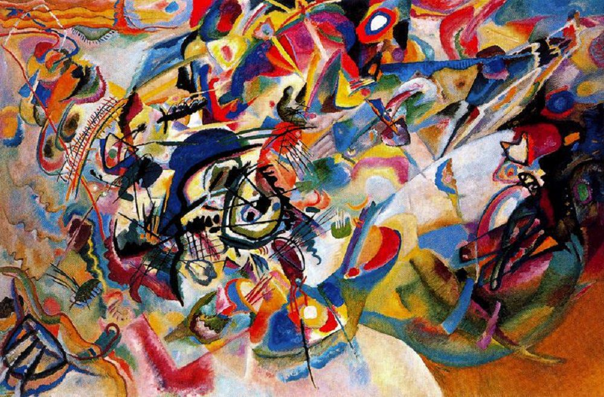

## Quantized Neural Networks, Neural Style Transfer, Real-Time Object Detection

### Training on Quantized Neural Networks (`QKeras`)

### Neural Style Transfer

  
   + 
  
   = 

&nbsp;

  
   + 
  
   = 

### Real-Time Object Detection (`YOLO`)

There are a bunch of dependency issues. Follow the instruction below carefully:

1. Install `tf-slim`

`python -m pip install git+https://github.com/google-research/tf-slim --user`

or

`python -m pip install -r requirements.txt --user`

2. Install `darkflow`

- `git submodule update --init` (Install from my git submodule where the broken `tensorflow` dependencies are fixed)

- `cd darkflow`

(Following are the same steps from the readme of `darkflow`)

- `git checkout eb7e830393f24233032b8578737141528be01d65` (Need to install first)

- `python setup.py build_ext --inplace`

- `git checkout master` (The one use Tensorflow 2.1)

- `mkdir bin && cd $_`

- `wget https://pjreddie.com/media/files/yolov2.weights`

3. (Optional, comment out the code) Install `pafy` to test Youtube videos

- `python -m pip install pafy youtube_dl --upgrade --user`

4. Rock n' roll!